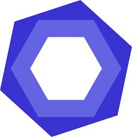

<a name="readme-top"></a>
<div align="center">
   <h1>🤖✅ Full Stack AI Gemini ✅🤖</h1>
</div>
  <div align="center">
    
  </div>

# 📗 Table of Contents

- [📗 Table of Contents](#-table-of-contents)
- [🔊🎧 Full Stack Spotify](#-full-stack-gemini)
- [✅🚀 Deployment](#-deployment)
  - [🛠 Built With](#-built-with)
    - [Tech Stack](#tech-stack)
  - [💻 Getting Started](#-getting-started)
    - [Prerequisites](#prerequisites)
    - [Setup](#setup)
    - [Install](#install)
    - [💾 Database](#-database)
    - [Usage](#usage)
    - [Run tests](#run-tests)
  - [📊 Kanban Board](#-kanban-board)
  - [👥 Authors](#-authors)
  - [🔭 Future Features](#-future-features)
  - [🤝 Contributing](#-contributing)
  - [⭐️ Show your support](#️-show-your-support)
  - [🙏 Acknowledgments](#-acknowledgments)
  - [📝 License](#-license)

# 🤖✅ Full Stack Gemini ✅🤖<a name="full-stack-gemini"></a>

> In this new project I developed a Gemini Full Stack Artificial Intelligence application, which allows the user to communicate with Gemini's AI thanks to its API connection. Feel free to ask about any topic or idea you have, Gemini will respond quickly. I have used key technologies such as: React.js, TypeScript, JavaScript, Node, Vite and CSS.

# 💻✅ Deployment 

<a name="deployment"></a>

[CLICK HERE TO SEE THE LIVE DEMO](https://full-stack-gemini-git-developer-maximoortellis-projects.vercel.app/)

# 🛠 Built With 

<a name="built-with"></a>

# Tech Stack 

<a name="tech-stack"></a>

<div>
     <h2>Client side</h2>
     <ul>   
     <li>
        
        <a href="https://reactjs.org">React.js</a>
     </li>
     <li>
        
        <a href="https://developer.mozilla.org/en-US/docs/Web/JavaScript">JavaScript</a>
     </li>
     <li>
        
        <a href="https://www.typescriptlang.org/">TypeScript</a>
     </li>
      <li>
       
       <a href="https://eslint.org">Eslint</a>
     </li>
      <li>
        
        <a href="https://developer.mozilla.org/es/docs/Web/CSS">CSS</a>
     </li>
      <li>
       
       <a href="https://nodejs.org/en">NodeJS</a>
     </li>
</div>

<div>
       <h2>Server side</h2>
  <ul>
       <li>
          
          <a href="https://nextjs.org/">Next.js</a>
       </li>
       <li>
          
          <a href="https://ai.google.dev/gemini-api/docs?hl=es-419">Gemini AI</a>
       </li>
  </ul>
</div>

# React + Vite

This template provides a minimal setup to get React working in Vite with HMR and some ESLint rules.

Currently, two official plugins are available:

- [@vitejs/plugin-react](https://github.com/vitejs/vite-plugin-react/blob/main/packages/plugin-react/README.md) uses [Babel](https://babeljs.io/) for Fast Refresh
- [@vitejs/plugin-react-swc](https://github.com/vitejs/vite-plugin-react-swc) uses [SWC](https://swc.rs/) for Fast Refresh

## Getting Started

First, run the development server:

```bash
npm run dev
# or
yarn dev
# or
pnpm dev
# or
bun dev
```

Open [http://localhost:3000](http://localhost:3000) with your browser to see the result.

You can start editing the page by modifying `src/main.jsx`. The page auto-updates as you edit the file.

# Kanban board <a name="kanban-board"></a>
 - [Kanban board Project link](https://github.com/users/maximoortelli/projects/21)

# 👥 Authors 
<a name="author"></a>

👤 **Maximo Ortelli**

- 💻GitHub: [@Maximo Ortelli](https://github.com/maximoortelli)
- 💻LinkedIn: [Maximo Ortelli](https://www.linkedin.com/in/maximo-ortelli-rueda/)

# 🔭 Future Features 
<a name="future-features"></a>

- [x] Tailwind design
- [x] Tailwind animations and effects
- [x] Full responsiveness
- [x] Credential authentication
- [x] Github authentication
- [x] Client form validation and handling using react-hook-form
- [x] Server error handling using react-toast
- [x] Fetch data in server react components by directly accessing database.
- [x] Handle files like error.tsx and loading.tsx which are new Next 13 templating files to unify loading and error handling
- [x] Handle relations between Server and Child components!
- [x] The functionality has been added so that the user can like to the songs and they will be saved in the favorites section.
- [x] The functionality has been added so that the user can upload their song, with their author name, their song title and their cover image.
- [x] It has the function of registering and logging in.
- [x] PostgreSQL database connected successfully.

<p align="right">(<a href="#readme-top">back to top</a>)</p>

# 🤝 Contributing <a name="contributing"></a>

Contributions, issues, and feature requests are welcome!

Feel free to check the [issues page](https://github.com/maximoortelli/full-stack-gemini/issues).

<p align="right">(<a href="#readme-top">back to top</a>)</p>

# ⭐️ Show your support <a name="support"></a>

If you like this project please give it a star 😁🌟✨

<p align="right">(<a href="#readme-top">back to top</a>)</p>

# 🙏 Acknowledgments <a name="acknowledgements"></a>

I thank [Gemini and Google](https://ai.google.dev/gemini-api/docs?hl=en-US). This project is a replica to measure my skills as a Full Stack developer and improve my potential. This work is not intended to profit from or seek to do so, it is merely professional and personal evolution.

<p align="right">(<a href="#readme-top">back to top</a>)</p>

# 📝 License <a name="license"></a>

This project is [MIT](./LICENSE) licensed.

<p align="right">(<a href="#readme-top">back to top</a>)</p>
